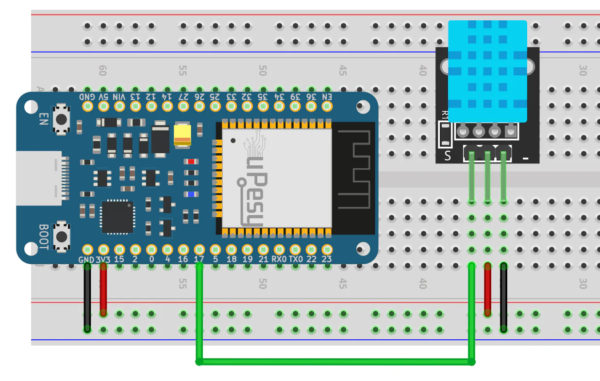

# IoTxChain-example
# IoTxChain Example: ESP32 DHT11 Sensor to Solana Blockchain

This example demonstrates how to use [IoTxChain](https://github.com/your-repo/IoTxChain) with an **ESP32** and **DHT11 Sensor** to send **temperature and humidity data directly to the Solana blockchain**.

## 📦 What This Example Does

- Reads temperature and humidity using DHT11.
- Signs and sends on-chain transactions using IoTxChain.
- Stores data on Solana using an Anchor-compatible smart contract.

## 🛠️ Wiring Diagram

Refer to the following schematic to connect your DHT11 sensor to your ESP32:

## 🚀 How to Run

1. Update `ssid`, `password`, and Solana keys in `main.cpp`.
2. Flash the code to your ESP32.
3. Open Serial Monitor to watch transactions being sent.
4. Verify transactions on [Solana Explorer](https://explorer.solana.com?cluster=devnet).

## 🎥 Demo Video

Watch the live demo here:  
**[Demo Video on YouTube](https://www.youtube.com/watch?v=sg0hpSKeipo)**

## 📝 License

This project is open source and available under the [MIT License](LICENSE).

---

Happy Building! 🚀